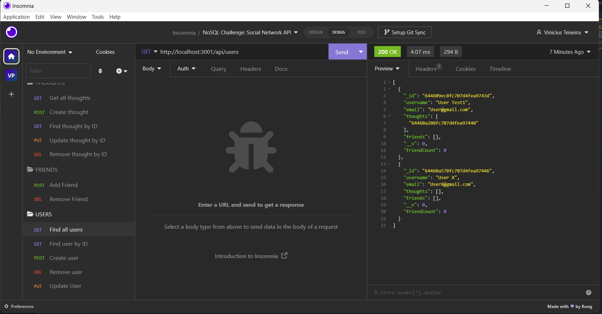

# nosql
## Social Network API ✅✨

## Description

This is a social network API built with Express.js for users to share their thoughts, react to friends’ thoughts, and create a friend list. This application uses a NoSQL database to store data.

## User Story

``` 
AS A social media startup
I WANT an API for my social network that uses a NoSQL database
SO THAT my website can handle large amounts of unstructured data
``` 

## Acceptance Criteria

``` 
GIVEN a social network API
WHEN I enter the command to invoke the application
THEN my server is started and the Mongoose models are synced to the MongoDB database
WHEN I open API GET routes in Insomnia Core for users and thoughts
THEN the data for each of these routes is displayed in a formatted JSON
WHEN I test API POST, PUT, and DELETE routes in Insomnia Core
THEN I am able to successfully create, update, and delete users and thoughts in my database
WHEN I test API POST and DELETE routes in Insomnia Core
THEN I am able to successfully create and delete reactions to thoughts and add and remove friends to a user’s friend list
```

## Installation

To install necessary dependencies, run the following command:

```
npm i
```

## Usage

To run the application, run the following command:

```
npm start
```

## Mock-Up

The following animation demonstrates the application functionality:




## Links

* [GitHub Repository](https://github.com/Vinni99/nosql)

* [Walkthrough Video](https://drive.google.com/file/d/1Kd-EPLtm_-kDhk-5nc-cn7bPMpareGcZ/view)